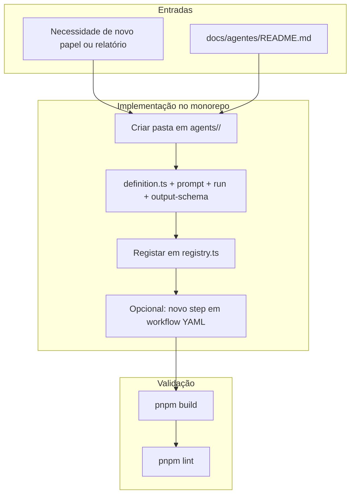

# Modularidade: agentes, workflows e multi-projeto (aios-celx)

> **Versão:** 1.0.0  
> **Criado:** 2026-04-02  
> **Nota:** Este documento **adapta** o conceito de “Squad Creator / Squads AIOS” de ecossistemas externos. O **aios-celx** **não** inclui `squad-creator`, comandos `*create-squad`, pastas `./squads/`, repositório `aios-squads`, nem API Synkra.

---

## Visão geral

No **aios-celx**, a modularidade assenta em:

| Conceito externo (“squad”) | Equivalente no aios-celx |
|----------------------------|-------------------------|
| Pacote de agentes + tasks + workflows | **`packages/agent-runtime/src/agents/<id>/`** + **`packages/workflow-engine/workflows/*.yaml`** + CLI **`aios`** |
| Manifest do squad (`squad.yaml`) | **`AgentDefinition`** em `definition.ts` + registo em **`registry.ts`** |
| Validação de schema | **TypeScript** (`pnpm build`), **`pnpm lint`**, schemas Zod onde existirem nos pacotes |
| Distribuição em níveis (local / público / marketplace | **Um monorepo Git**; projetos geridos em `projects/<projectId>/` (por omissão; podem estar no `.gitignore` da tua cópia) |
| Orquestração task-first | **Workflow YAML** (`steps`, `agent`, `gate`) + comandos `run`, `next`, `approve`, `run:task`, `run:qa` |

**Princípios alinhados ao repositório**

1. **Agentes como código** — cada agente é uma pasta com `definition.ts`, `prompt-template.md`, `run.ts` (quando aplicável).  
2. **Workflows declarativos** — `packages/workflow-engine/workflows/`.  
3. **Validação** — build e lint do monorepo; não há `*validate-squad` nem `squad-schema.json` neste repo.  
4. **Extensão** — adicionar agente = código + registo; não há publicação para marketplace integrada.

---

## Ficheiros e pastas relevantes (monorepo)

### Agentes

| Caminho | Função |
|---------|--------|
| `packages/agent-runtime/src/agents/<agentId>/definition.ts` | `id`, `reads`, `writes`, `description` |
| `packages/agent-runtime/src/agents/<agentId>/prompt-template.md` | Prompt (placeholders conforme agente) |
| `packages/agent-runtime/src/agents/<agentId>/run.ts` | Handler do **mock-engine** (quando existe) |
| `packages/agent-runtime/src/agents/<agentId>/output-schema.ts` | Caminhos de saída esperados |
| `packages/agent-runtime/src/registry.ts` | Mapa `agentId` → definition + handler |
| `packages/agent-runtime/src/agents/README.md` | Convenções |

### Workflows

| Caminho | Função |
|---------|--------|
| `packages/workflow-engine/workflows/default-software-delivery.yaml` | Fluxo MVP típico |
| `packages/workflow-engine/workflows/full-catalog-delivery.yaml` | Fluxo alargado (v2/v3 de agentes) |

### Projetos geridos e ecossistema

| Caminho | Função |
|---------|--------|
| `projects/<projectId>/.aios/config.yaml` | `workflow`, `engines`, `projectId` |
| `projects/<projectId>/.aios/state.json` | Estado de execução |
| `.aios/projects-registry.yaml` | Registo de projetos (raiz do monorepo) |
| `.aios/portfolio.yaml` | Visão de portfolio (quando usado) |

### Catálogo documental

| Caminho | Função |
|---------|--------|
| `docs/agentes/README.md` | Papéis MVP, v2, v3 |
| `docs/agentes/catalogo-detalhado.md` | Detalhe dos agentes |
| `README.md`, `AGENTS.md` | CLI e orientação |

---

## Fluxo conceptual: “criar capacidade nova” no aios-celx

Isto substitui o pipeline `*design-squad` → `*create-squad` → `*validate-squad` de outros ecossistemas.

---

## Mapeamento de ideias (documento externo → aios-celx)

| Ideia no documento “Squad Creator” | No aios-celx |
|-----------------------------------|--------------|
| `*create-squad` | Adicionar agente + registo (ver secção seguinte) |
| `*design-squad` / blueprint | Ler `docs/agentes/`, PRD do projeto, e desenhar `AgentDefinition` + prompts antes de codificar |
| `*validate-squad` | `pnpm build` e `pnpm lint` na raiz; testes onde existirem |
| `*list-squads` | `pnpm exec aios` com comando que liste agentes (se exposto) ou inspeccionar `registry.ts` / `docs/agentes/README.md` |
| `*analyze-squad` / `*extend-squad` | Refactor documentado + alterações incrementais em `packages/agent-runtime` |
| `*migrate-to-v2` | Não aplicável como comando; evolução de versões é via Git e refactors |
| `*publish-squad` / Synkra / aios-squads | **Não implementado** — contribuições via PR para o monorepo |
| `*generate-workflow` | Criar ou editar ficheiro em `packages/workflow-engine/workflows/` e referenciar em `config.yaml` do projeto |

---

## Checklist: adicionar um novo agente (resumo)

1. Duplicar o padrão de uma pasta existente em `packages/agent-runtime/src/agents/`.  
2. Definir `id`, `reads`, `writes` em `definition.ts`.  
3. Escrever `prompt-template.md` com placeholders compatíveis com o `run.ts` (se existir).  
4. Implementar `run.ts` ou *route hint* (ex.: `engineer`, `qa-reviewer`).  
5. Registar em `packages/agent-runtime/src/registry.ts` (`definitions` + `handlers`).  
6. Documentar em `docs/agentes/README.md` e, se útil, em `catalogo-detalhado.md`.  
7. Correr `pnpm build` e `pnpm lint` na raiz.

---

## Multi-projeto e “portfolio”

O papel mais próximo de **visão entre pacotes/projetos** no catálogo v3 é o **`portfolio-strategist`** (`docs/portfolio-outlook.md` em modo mock). Não substitui um sistema de squads descarregáveis; resume artefactos já presentes nos projetos geridos.

---

## O que **não** existe neste repositório

- Agente `@squad-creator` ou **Craft** como id de runtime  
- Pastas `./squads/{nome}/`, `squad.yaml`, TASK-FORMAT-V1 externo  
- Scripts `squad-generator.js`, `squad-validator.js` sob `.aios-core/`  
- Comandos `*create-squad`, `*validate-squad`, `*publish-squad`  
- Integração CodeRabbit / Synkra / ClickUp ligada ao CLI `aios`  
- Três níveis de distribuição (marketplace); há **um** código-fonte e **Git** como meio de partilha  

---

## Boas práticas

1. **Alinhar com o catálogo** — novos ids devem encaixar em MVP / v2 / v3 ou ser claramente *advisory*.  
2. **Workflows** — ao adicionar passos, manter *gates* e `agent` coerentes com ficheiros que o projeto realmente gera.  
3. **Motores** — `mock-engine` por defeito; outras engines em `packages/engine-adapters` podem ser *stubs*.  
4. **Projetos geridos** — usar `--project <projectId>`; não assumir estrutura de “squad” dentro do repo do produto.

---

## Resolução de problemas

| Situação | O que verificar |
|----------|------------------|
| Agente não aparece no CLI | `registry.ts` e `listAgents` |
| Passo do workflow não corre | `.aios/config.yaml` → `workflow` e `state.json` → `currentAgent` |
| Erro de build após adicionar agente | Imports, tipos `AgentDefinition`, export default/`agentDefinition` |
| Expectativa de “instalar squad” de URL | Não suportado; clonar monorepo ou copiar pasta do agente manualmente |

---

## Referências internas

- [Catálogo de agentes](./README.md)  
- [Plano de implementação](./plano-implementacao.md)  
- `packages/agent-runtime/src/agents/README.md`  
- `packages/workflow-engine/workflows/`  
- [README da raiz](../../README.md), [AGENTS.md](../../AGENTS.md)  

---

## Resumo

| Aspecto | aios-celx |
|---------|-----------|
| **Pacotes modulares de agentes** | Pastas sob `packages/agent-runtime/src/agents/<id>/` + `registry.ts` |
| **Orquestração** | YAML em `packages/workflow-engine/workflows/` + CLI |
| **Validação** | Build, lint, testes do monorepo |
| **Distribuição** | Git / PRs; sem marketplace de squads |
| **Equivalente a “Squad Creator”** | Processo de engenharia documentado neste ficheiro + checklist |

---

## Changelog

| Data | Descrição |
|------|-----------|
| 2026-04-02 | Documento inicial: equivalências entre sistema de squads externo e aios-celx. |

---

*— Cris, módulos no sítio certo*
