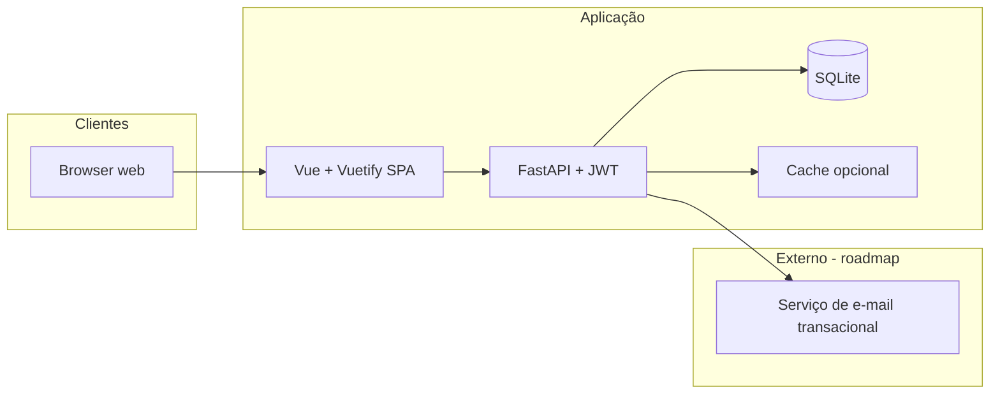

# Arquitetura — CRM AIOS-CELX (`crm-comercial`)

## Contexto

**Fronteira do sistema:** o CRM **crm-comercial** expõe uma **API HTTP REST** em **FastAPI** consumida por um **SPA Vue + Vuetify**. Autenticação com **JWT** (access token no header `Authorization: Bearer`); autorização (RBAC) com claims no token e/ou consulta à base; perfis e permissões persistidos em **SQLite**.

**Fora do MVP (opcional):** filas para envio assíncrono de e-mail, workers de relatórios pesados, integrações com sistemas externos.

## Components

_Título em inglês para compatibilidade com gates do workflow aios; conteúdo alinhado à **Visão lógica de componentes** abaixo._

| Component | Responsibility |
|-----------|----------------|
| **Web client** | Vue 3 + Vuetify 3; Pinia; JWT in `Authorization`; call FastAPI `/api/v1`. |
| **Application API** | FastAPI; JWT; RBAC; Pydantic; CRM rules; OpenAPI. |
| **Persistence** | SQLite; SQLAlchemy + Alembic. |
| **E-mail** | Transactional e-mail for reset and invites. |

## Visão lógica de componentes

| Componente | Responsabilidade |
|--------------|------------------|
| **Cliente web** | **Vue 3** + **Vuetify 3** (Material Design): layout, tema claro/escuro (`v-theme`), `v-data-table`, formulários, navegação; cliente HTTP (axios/fetch) para a API; estado (Pinia); **armazenar access JWT** (memória + `localStorage` ou só memória conforme política) e enviar `Authorization: Bearer`; refresh quando aplicável. |
| **API de aplicação** | **FastAPI**: rotas versionadas `/api/v1`, dependências de injeção para validação JWT e RBAC, Pydantic para schemas; **JWT** emitido no login (access; refresh opcional em cookie HttpOnly ou corpo — definir no implementação); regras de negócio CRM; agregações para dashboard; OpenAPI automático em `/docs` (dev) ou desativado em prod conforme política. |
| **Camada de persistência** | **SQLite** — ficheiro único; modelo relacional para entidades CRM, configuração (pipelines, tags, campos customizados) e auditoria. |
| **Serviço de e-mail** | Envio de recuperação de senha e convites (via API do provedor). |

**Stack fechada:** **Front** — Vue + Vuetify; **API** — FastAPI + JWT; **BD** — SQLite (ver secções abaixo).

## Backend — FastAPI e JWT

| Aspecto | Decisão |
|---------|---------|
| **Framework** | **FastAPI** (Python 3.11+ recomendado). |
| **Auth** | **JWT**: access token assinado (algoritmo **RS256** ou **HS256** — escolher e documentar segredos/chaves em env); claims mínimos: `sub` (user id), `exp`, opcionalmente `permissions` ou role para cache de RBAC. |
| **Refresh** | **Assunção MVP:** refresh token (JWT de longa duração ou opaco armazenado em BD) e endpoint `POST /auth/refresh`; invalidação de refresh no logout se persistido. |
| **Proteção de rotas** | Dependência FastAPI (`HTTPBearer` + validação de assinatura e expiração); retorno `401` se inválido; `403` se token válido mas sem permissão. |
| **ORM / SQL** | **SQLAlchemy 2.x** + **Alembic** para migrações SQLite (alinhado ao ecossistema Python). |
| **Validação** | **Pydantic v2** nos request/response bodies. |
| **Documentação** | OpenAPI 3 gerado pelo FastAPI; pode alimentar cliente TypeScript no front (opcional). |

Variáveis de ambiente típicas: `JWT_SECRET` ou par de chaves RSA, `JWT_ALGORITHM`, `ACCESS_TOKEN_EXPIRE_MINUTES`, `DATABASE_URL` (`sqlite+aiosqlite:///...` ou sync conforme stack).

## Frontend — Vue e Vuetify

| Aspecto | Decisão |
|---------|---------|
| **Framework UI** | **Vue.js 3** (Composition API como padrão nas vistas novas). |
| **Biblioteca de componentes** | **Vuetify 3** — tabelas, formulários, diálogos, navegação, tema claro/escuro integrado. |
| **Empacotamento** | **Vite** (recomendado para Vue 3) ou equivalente alinhado ao template oficial. |
| **Roteamento** | **Vue Router** com rotas **públicas** e **autenticadas**: `/` → **Home** (página de vendas do produto, sem layout CRM); `/login` → Login; após JWT válido, layout com sidebar para `/dashboard`, `/leads`, etc. **Navigation guards** redirecionam rotas protegidas sem token para `/login`. |
| **Estado global** | **Pinia** (sessão do usuário, preferências de tema/menu, caches leves de listagens). |
| **Integração com API** | Cliente HTTP com base URL `/api/v1`; interceptors para `Authorization` e tratamento de erros conforme [`api-contracts.md`](./api-contracts.md). |
| **Kanban / DnD** | Componente compatível com Vue 3 (ex.: `vue-draggable-next` ou biblioteca escolhida no projeto) integrado a layout Vuetify. |

**Theming:** usar o sistema de tema do Vuetify para **light/dark** alinhado à especificação (persistência da escolha no perfil do usuário ou `localStorage` até sincronizar com `/me`).

## Persistência — SQLite

| Aspecto | Decisão |
|---------|---------|
| **Motor** | **SQLite** (versão suportada pelo runtime escolhido — ex. 3.40+). |
| **Armazenamento** | Um ficheiro `.db` (ou `.sqlite`) por instância de deploy; caminho configurável por variável de ambiente (ex.: `DATABASE_URL` ou `SQLITE_PATH`). |
| **Modo de escrita** | Preferir **WAL** (`PRAGMA journal_mode=WAL`) para melhor concorrência leitura/escrita em servidor web. |
| **ORM / migrações** | **SQLAlchemy** + **Alembic** (migrações versionadas no repositório). |
| **Backups** | Cópia do ficheiro em janela de manutenção ou snapshot antes de migrações; para produção, automatizar cópia segura (off-site). |
| **Limitações** | Escrita essencialmente **single-writer**; evitar cargas massivas concorrentes no mesmo nó sem desenho (filas). Escala horizontal **multi-instância** com o mesmo ficheiro partilhado **não** é suportada — para isso migrar para PostgreSQL ou outro SGBD (ADR futuro). |
| **Integridade** | `FOREIGN KEY` activadas (`PRAGMA foreign_keys=ON`) nas ligações entre tabelas. |

O modelo lógico de entidades na secção seguinte aplica-se a tabelas SQLite (tipos `INTEGER`, `TEXT`, `REAL`, `BLOB`; datas em ISO 8601 em `TEXT` ou Unix em `INTEGER` — escolher convenção no primeiro schema).

## Módulos da API (alinhamento com domínio)

| Módulo | Conteúdo |
|--------|----------|
| **Auth** | Login (emissão JWT), logout (invalidação refresh se aplicável), refresh, reset de senha. |
| **Users & RBAC** | Usuários, perfis, permissões, equipes. |
| **CRM core** | Leads, empresas, contatos, oportunidades. |
| **Pipeline** | Pipelines, etapas, transições e validações. |
| **Tasks & Activities** | Tarefas e atividades com polimorfismo de vínculo (entidade relacionada). |
| **Reporting** | Queries agregadas e exportação. |
| **Settings** | Tags, motivos de perda, definição de campos customizados, preferências de tenant/organização se aplicável. |

## Dados — entidades principais

Modelo conceitual (não é DDL):

- **User**, **Profile**, **Permission** (ou matriz perfil × recurso × ação).
- **Lead**, **Company**, **Contact**, **Opportunity**.
- **Pipeline**, **Stage** (ordem, tipo: aberta / ganho / perdido).
- **Task**, **Activity** — referências opcionais a Lead, Company, Contact, Opportunity.
- **Tag** (com escopo por tipo de entidade).
- **LossReason** (e vínculos a pipelines).
- **CustomFieldDefinition** + **CustomFieldValue** (EAV ou JSON tipado por entidade — decisão em ADR).
- **AuditLog** (opcional mas recomendado para exclusões e RBAC).

**Integridade:** oportunidade referencia empresa e opcionalmente contato e lead de origem; exclusões podem ser **soft delete** para preservar relatórios.

## Multi-tenancy

**Assunção MVP:** uma **organização** (tenant) por instância de deploy ou um único tenant por base de dados. Se no futuro houver multi-tenant na mesma instância, todas as tabelas de negócio devem carregar `organization_id` e os filtros de query devem ser obrigatórios — documentar em ADR antes da implementação.

## Segurança

- HTTPS obrigatório em produção; **nunca** enviar JWT em query string.
- Senhas com hash forte (**bcrypt** ou **argon2** via `passlib` / equivalente) e política configurável.
- **JWT access** de curta duração; **refresh** com rotação e armazenamento seguro (ver ADR-003); segredo ou chave privada fora do repositório.
- Rate limiting em login e endpoints de exportação (middleware FastAPI ou proxy reverso).

## Decisões e ADRs

ORM, convenção de IDs (UUID vs inteiro autoincrement), paginação em cursores vs offset, e modelo EAV vs JSON para custom fields devem ser registados em [`decision-log.md`](./decision-log.md).

## Documentos relacionados

- Contratos HTTP: [`api-contracts.md`](./api-contracts.md).
- PRD: [`prd.md`](./prd.md).
- Plano de testes (pytest, unitários e integração): [`plano-testes-api.md`](./plano-testes-api.md).

_Atualizado: **Vue 3 + Vuetify 3** (front), **FastAPI + JWT** (API), **SQLite** (dados)._
