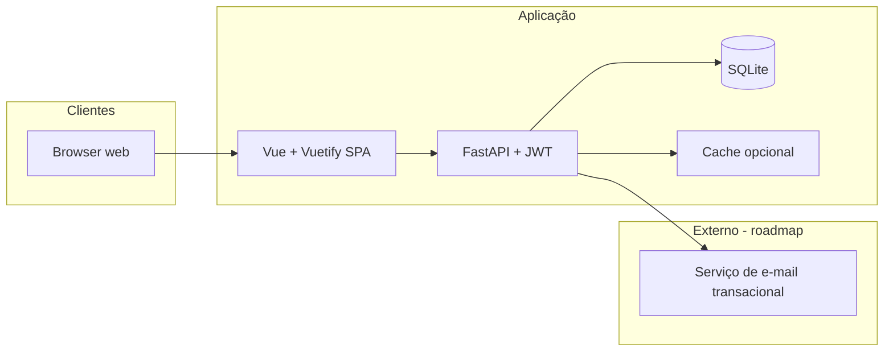

# Implementation report — TASK-2

## Task

| Field | Value |
|-------|--------|
| **ID** | TASK-2 |
| **Story** | STORY-2 |
| **Title** | Scaffold API FastAPI — SQLite, Alembic, JWT, login e /me |
| **Type** | implementation |
| **Status** | done (after mock run) |

### Description

Criar pacote Python sob projects/crm-comercial/api com app FastAPI versionada em /api/v1, modelo User, hash de senha, emissão e validação JWT (access), rotas POST /auth/login e GET /me; SQLite via env; Alembic com primeira migração; pytest + httpx AsyncClient em testes de integração conforme plano-testes-api.md.

### Target files (from task)

- `api/`
- `docs/architecture.md`
- `docs/api-contracts.md`

### Acceptance criteria

- POST /api/v1/auth/login retorna accessToken e user quando credenciais válidas
- GET /api/v1/me exige Authorization Bearer e devolve perfil
- Testes pytest passam (mínimo login 200, /me 401 sem token)
- README ou docs com comandos uvicorn e pytest no diretório da API

### Notes

Stack definida em decision-log (FastAPI, JWT, SQLite).

## Context read

- **Story** (STORY-2): Backend — API FastAPI com JWT e SQLite
- **Architecture** (`docs/architecture.md`): excerpt below
- **API contracts** (`docs/api-contracts.md`): excerpt below
- **Backlog tasks** (`backlog/tasks.yaml`): snapshot excerpt

### Architecture excerpt

```
# Arquitetura — crm-comercial

## Contexto



**Fronteira do sistema:** o CRM **crm-comercial** expõe uma **API HTTP REST** em **FastAPI** consumida por um **SPA Vue + Vuetify**. Autenticação com **JWT** (access token no header `Authorization: Bearer`); autorização (RBAC) com claims no token e/ou consulta à base; perfis e permissões persistidos em **SQLite**.

**Fora do MVP (opcional):** filas para envio assíncrono de e-mail, workers de relatórios pesados, integrações com sistemas externos.

## Components

_Título em inglês para compatibilidade com gates do workflow aios; conteúdo alinhado à **Visão lógica de componentes** abaixo._

| Component | Responsibility |
|-----------|----------------|
| **Web client** | Vue 3 + Vuetify 3; Pinia; JWT in `Authorization`; call FastAPI `/api/v1`. |
| **Application API** | FastAPI; JWT; RBAC; Pydantic; CRM rules; OpenAPI. |
| **Persistence** | SQLite; SQLAlchemy + Alembic. |
| **E-mail** | Transactional e-mail for reset and invites. |

```

### API contracts excerpt

```
# Contratos de API — crm-comercial

Este documento define **convenções** e um **mapa de recursos** HTTP alinhado ao PRD e à especificação funcional. A implementação em **FastAPI** expõe **OpenAPI 3** automaticamente (útil para validação e geração de cliente). Tipos e campos seguem o modelo de domínio em [`prd.md`](./prd.md) e [`especificacao-funcional-crm-telas.md`](./especificacao-funcional-crm-telas.md).

## Convenções

| Item | Definição |
|------|-----------|
| **Base URL** | `https://{host}/api/v1` (prefixo versionado). |
| **Formato** | `Content-Type: application/json; charset=utf-8`. |
| **Autenticação** | **JWT:** `Authorization: Bearer <access_token>` em todos os endpoints protegidos (exceto login, forgot-password, health). Access token emitido por `POST /auth/login`; renovação via `POST /auth/refresh` com refresh token (corpo ou cookie conforme implementação — ver [`architecture.md`](./architecture.md)). |
| **Locale** | Respostas de validação em **pt-BR**; datas em **ISO 8601** (UTC ou com offset); o cliente exibe no fuso do usuário. |
| **Idempotência** | `Idempotency-Key` opcional em `POST` críticos (ex.: conversão de lead). |

### Paginação de listagens

Query comuns:

- `page` (inteiro ≥ 1), `pageSize` (ex.: 10, 25, 50, 100).
- **Alternativa futura:** `cursor` + `limit` para grandes volumes — documentar ao implementar.

Resposta envelope sugerido:

```json
{
  "data": [],
  "meta": {
    "page": 1,
    "pageSize": 25,
    "totalItems": 0,
    "totalPages": 0
  }
}
```

### Filtros

- Filtros simples: query params nomeados (`status`, `responsibleUserId`, `pipelineId`, etc.).
- Filtros complexos: `POST /{resource}/search` com corpo JSON (lista de critérios: campo, operador `eq|ne|in|gte|lte|between|contains`, valor) **ou** query serializada — **uma abordagem deve ser escolhida e mantida** (registar em ADR).

```

### Tasks YAML excerpt

```json
{
  "tasks": [
    {
      "id": "TASK-1",
      "storyId": "STORY-1",
      "title": "Completar PRD e YAML de backlog",
      "description": "Garantir que backlog YAML valida e contém pelo menos uma task executável para o engenheiro (mock run:task).",
      "type": "implementation",
      "status": "done",
      "files": [
        "backlog/tasks.yaml",
        "docs/prd.md"
      ],
      "acceptanceCriteria": [
        "tasks.yaml faz parse com o schema de task",
        "Existe pelo menos uma task com id e storyId"
      ],
      "notes": "Usada pelo fluxo engineer (Bloco 4.2) em modo mock."
    },
    {
      "id": "TASK-2",
      "storyId": "STORY-2",
      "title": "Scaffold API FastAPI — SQLite, Alembic, JWT, login e /me",
      "description": "Criar pacote Python sob projects/crm-comercial/api com app FastAPI versionada em /api/v1, modelo User, hash de senha, emissão e validação JWT (access), rotas POST /auth/login e GET /me; SQLite via env; Alembic com primeira migração; pytest + httpx AsyncClient em testes de integração conforme plano-testes-api.md.",
      "type": "implementation",
      "status": "in_progress",
      "files": [
        "api/",
        "docs/architecture.md",
        "docs/api-contracts.md"
      ],
      "acceptanceCriteria": [
        "POST /api/v1/auth/login retorna accessToken e user quando credenciais válidas",
        "GET /api/v1/me exige Authorization Bearer e devolve perfil",
        "Testes pytest passam (mínimo login 200, /me 401 sem token)",
        "README ou docs com comandos uvicorn e pytest no diretório da API"
      ],
      "notes": "Stack definida em decision-log (FastAPI, JWT, SQLite)."
    },
    {
      "id": "TASK-3",
      "storyId": "STORY-3",
      "title": "Scaffold SPA Vue 3 + Vuetify — Home e Login",
      "description": "Criar projects/crm-comercial/web com Vite, Vue 3, Vuetify 3, Vue Router (rotas / e /login), Pinia para token e preferência de tema, cliente HTTP (axios) para VITE_API_BASE_URL + /api/v1; página Home alinhada a especificacao-funcional-crm-telas TELA 0; Login alinhado a TELA 1.",
      "type": "implementation",
      "status": "done",
      "files": [
        "web/",
        "docs/especificacao-funcional-crm-telas.md"
      ],
      "acceptanceCriteria": [
        "pnpm/npm run dev serve a SPA; / mostra Home pública sem sidebar CRM",
        "/login permite submeter email+senha e guarda JWT em Pinia (e storage se definido)",
        "Toggle tema claro/escuro aplicado via Vuetify"
      ],
      "notes": "Integrar com API da TASK-2 quando disponível (mesmo origin ou CORS)."
    },
    {
      "id": "TASK-4",
      "storyId": "STORY-2",
      "title": "Testes API — auth e contrato de erro",
      "description": "Completar cobertura mínima do plano-testes-api.md para o módulo auth\n(JWT inválido ou expirado, login com credenciais erradas, envelope de erro\nJSON conforme api-contracts). Fixtures com BD SQLite em memória.\n",
      "type": "implementation",
      "status": "done",
      "files": [
        "api/tests/",
        "docs/plano-testes-api.md"
      ],
      "acceptanceCriteria": [
        "pytest cobre pelo menos os casos JWT-01 a JWT-03 e login 401",
        "Documentação de como correr testes no README da API"
      ],
      "notes": "Depende da base criada em TASK-2; pode ser feita em paralelo após TASK-2 estar mergeada."
    }
  ]
}
```

## Implementation plan (mock)

1. Align code paths with `files` and architecture boundaries.
2. Add or adjust tests under `tests/` when the task implies behaviour changes.
3. Keep changes isolated to project `crm-comercial`.

## Actions performed (mock)

- Marked task **in_progress** then **done** in `backlog/tasks.yaml`.
- Updated project state: `currentTaskId`, `activeStoryId`, `lastExecutionType: engineer-task`.
- Git branch skipped (disabled or no local `.git`).

## Limitations

- No LLM or real code edits in Bloco 4.2 — this report is deterministic mock output.

## Next steps

- Run tests and manual verification for files listed in the task.
- Open a Git commit via `aios git:commit` when ready.

---
_Generated by **engineer task runner** (mock) at 2026-04-02T23:18:11.814Z_
