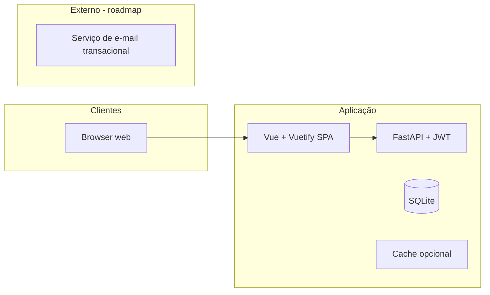

# QA report — TASK-3

## Summary

| Field | Value |
|-------|--------|
| **Story** | STORY-3 (Frontend — Vue 3, Vuetify e rotas públicas) |
| **Generated** | 2026-04-02T23:18:31.852Z |

**Final status**: `approved`

**Criteria checked:** architecture.md present / readable, api-contracts.md present / readable, Implementation report exists, Acceptance criteria reviewed

**Validation:** 4 passed, 0 failed.

## Findings

_No findings._

## Recommendation

Proceed to merge or next task.

---
_Generated by **qa-reviewer** (mock) — Bloco 4.3_


## Evidence read (excerpts)

### Architecture (first lines)

```
# Arquitetura — crm-comercial

## Contexto



### API contracts (first lines)

```
# Contratos de API — crm-comercial

Este documento define **convenções** e um **mapa de recursos** HTTP alinhado ao PRD e à especificação funcional. A implementação em **FastAPI** expõe **OpenAPI 3** automaticamente (útil para validação e geração de cliente). Tipos e campos seguem o modelo de domínio em [`prd.md`](./prd.md) e [`especificacao-funcional-crm-telas.md`](./especificacao-funcional-crm-telas.md).

## Convenções

| Item | Definição |
|------|-----------|
| **Base URL** | `https://{host}/api/v1` (prefixo versionado). |
| **Formato** | `Content-Type: application/json; charset=utf-8`. |
| **Autenticação** | **JWT:** `Authorization: Bearer <access_token>` em todos os endpoints protegidos (exceto login, forgot-password, health). Access token emitido por `POST /auth/login`; renovação via `POST /auth/refresh` com refresh token (corpo ou cookie conforme implementação — ver [`architecture.md`](./architecture.md)). |
| **Locale** | Respostas de validação em **pt-BR**; datas em **ISO 8601** (UTC ou com offset); o cliente exibe no fuso do usuário. |
| **Idempotência** | `Idempotency-Key` opcional em `POST` críticos (ex.: conversão de lead). |

### Paginação de listagens

Query comuns:

- `page` (inteiro ≥ 1), `pageSize` (ex.: 10, 25, 50, 100).
- **Alternativa futura:** `cursor` + `limit` para grandes volumes — documentar ao implementar.
```

### Implementation report (first lines)

```
# Implementation report — TASK-3

## Task

| Field | Value |
|-------|--------|
| **ID** | TASK-3 |
| **Story** | STORY-3 |
| **Title** | Scaffold SPA Vue 3 + Vuetify — Home e Login |
| **Type** | implementation |
| **Status** | done (after mock run) |

### Description

Criar projects/crm-comercial/web com Vite, Vue 3, Vuetify 3, Vue Router (rotas / e /login), Pinia para token e preferência de tema, cliente HTTP (axios) para VITE_API_BASE_URL + /api/v1; página Home alinhada a especificacao-funcional-crm-telas TELA 0; Login alinhado a TELA 1.

### Target files (from task)

- `web/`
- `docs/especificacao-funcional-crm-telas.md`

### Acceptance criteria

- pnpm/npm run dev serve a SPA; / mostra Home pública sem sidebar CRM
- /login permite submeter email+senha e guarda JWT em Pinia (e storage se definido)
```
